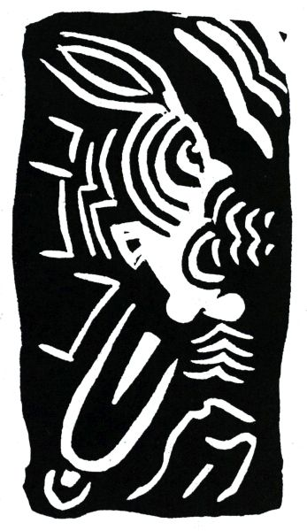

<section>

Tím starým světem přec jsi znaven na konec

Pastýřko Eiffelko jak bečí stádo mostů dnes

Řecký a římský starověk se ti už přežily

Zde starodávně se tváří i automobily  
Jen náboženství zůstalo nové ve starých věcí tříšti  
Zůstalo zcela prosté jak hangáry na letišti

Jediné neantické v Evropě křesťanství je  
Evropan nejmodernější jste vy ó papeži Pie  
A tebe zdržuje stud když okna na tebe hledí  
Vstoupiti do kostela a jíti ke zpovědi  
Čteš letáky ceníky plakáty jež nahlas zpívají  
Toť poesie dne a prosu dne žurnály dávají  
Sešity po šestáku o detektivech kteří prosluli  
Portréty slavných mužů a steré tituly

</section>

<section>

</section>

<section>

Viděl jsem dnes a jméno už nevím pěknou ulici  
Novou a čistou byla to sluneční polnice  
Šéfové dělnice a krásné písařky z bureau  
Z pondělí do soboty čtyřikrát denně tudy se berou  
Z rána tu třikrát tovární píšťala zní  
Chraptivý zvon zde zaštěká k poledni  
Nápisy na zdech a tabulích štíty a vyhlášky  
Vřeští a štěbetají jak o závod s papoušky  
Mám rád tu pěknou ulici průmyslu a píle  
Ležící v Paříži mezi třídou des Ternes a ulicí Aumont-Thiéville.

</section>

<section>

</section>

<section>

Hle mladá ulice a ty sám jsi jen malé dítě  
Tvá matka jinak než modře a bíle nešatí tě  
Jsi velmi zbožný a René Dalize tvůj první kamarád  
Má stejně s tebou církevní pompu nade vše rád  
Je devět večer plyn stažen do modra tajně se kradete z ložnice  
Po celou noc se v kolejní kapli modlíte  
Zatím co věčná spanilá hlubina ametystná  
Oblévá na vždy planoucí glorii Krista  
Toť krásná lilie již všichni pěstíme  
Toť rusovlasá pochodeň jež větrem nehasne  
Toť bledý a nachový syn bolestiplné ženy  
Toť strom vždy modlitbami všemi přetížený  
Toť dvojmocnina cti a věčnosti  
Toť hvězda o cípech šesti  
Toť Bůh jenž v pátek mře a v neděli vzkříšen jesti

</section>

<section>

</section>

<section>

Toť Kristus který k nebi lépe než letci vzlétá  
Jemu náleží podnes výškový rekord světa  
Kristus panenka oka  
Dvacátá panenka věků v tom on se vyzná  
A změněn v ptáka náš věk jak Ježíš nahoru letí

</section>

<section>

</section>

<section>

Ďáblové v propastech zvedají hlavu by mohli naň pohleděti  
Praví že napodobí co uměl už Šimon kouzelník  
Křičí že zná-li létat má slouti záletník  
Andělé létají lehce kolem hezkého letce  
Ikarus Enoch Eliáš Apollonius z Thyany  
Kol prvního létadla krouží u nebeské brány  
Uctivě pouštějí ty jež unáší Svatá Eucharistie  
Ty kněze kteří věčně stoupají pozvedajíce hostie  
Avion s křídly nesloženými se snáší a klesá  
Ty miliony vlaštovek přilétnou na nebesa  
Letmo se blíží havrani sovy sokoli naši ptáci  
Z Afriky přicházejí ibisi marabuti plameňáci  
Pták Noh jemuž básně a pohádky hlásají slávu  
V pařátech nese leb Adamovu první hlavu  
Z obzoru letí orel a vyráží velký křik  
A z Ameriky došel malý kolibřík  
Z Číny sem přišli pihi dlouzí a pružní  
Ti mají jen po jednom křídle a létají v párech družni  
Pak ejhle holubice duch neposkvrněný sám  
Jejž provází lýrovec a tisícioký páv  
A fénix hranice jež sama se zapálí  
V svém žhavém popeli na chvíli vše zahalí  
Sirény opustily své nebezpečné úskaliny  
A chvátají krásně zpívajíce všecky tři

</section>

<section>

</section>

<section>

A všichni orli fénix i pihi z Číny  
Se s létacím strojem svorně pobratří

Nyní ty kráčíš sám davem po Paříži  
Kol tebe stáda autobusů řvou řičí a víří  
Bolestná úzkost lásky hrdlo svírá ti  
Jak bys už nikdy se neměl lásky dočkati  
Vstoupil bys do kláštera kdybys žil v dávném čase  
Když na rtech si najdete modlitbu vy stydíte do ruda se  
Sobě se vysmíváš a smích tvůj plá výhní pekelnou  
Jiskřičky jeho zlatí života tvého dno  
Toť obraz visící v temnu galerie  
A vidět jej z blízka ti třeba chvílemi je

Dnes jdeš po Paříži ženy jsou krví znamenány  
Bylo to na sklonku krásy jen nerad toho vzpomínám

Z koruny žhavých plamenů pozřela na mne Panna v Chartres  
Krev vašeho Svatého Srdce mne zalila na Montmartru  
Jsem chor slyše ta slova požehnaná

</section>

<section>

</section>

<section>

Láska jíž trpím je má choroba tajná  
A obraz který tě posedl ti pomůže přežít úzkost a bdění  
Vždy u tebe dlí ten obraz jenž prchá k nevrácení

U Středozemního moře jsi nyní na pobřeží  
Pod citroníky jež celý rok kvetou svěží  
S přáteli svými se projíždíš ve člunu  
Jeden je z Nizzy dva z Turbia jeden z Mentonu  
Sepií hlubinných se děsí oči naše  
A v chaluhách plují ryby obrazy Mesiáše

Jsi v zahradě hospůdky v okolí Prahy  
Cítíš se zcela šťasten na stůl růži ti dali  
A místo abys psal svou povídku lenošíš pohříchu  
Hledě na mandelinku spící v růžovém kalichu

</section>

<section>

</section>

<section>

V achátech Svatovítských zříš zděšen své vlastní rysy  
Na smrt jsi smuten byl v ten den kdy sebe v nich objevil jsi

</section>

<section>

</section>

<section>

</section>

<section>

Podoben Lazaru kterého světlo drtí  
Pozpátku točí se ručičky hodin v židovské čtvrti  
A ty couváš ve vlastním životě pomalu  
Jda na Hradčany nahoru a poslouchaje k večeru  
Jak v hospodách české písně zpívají

Hle jsi uprostřed melounů v Marseilli

Hle jsi v Koblenci v hotelu s obrem na vývěsní tabuli

Hle sedíš v Římě pod japonskou mišpulí

Hle jsi v Amsterodamu s dívkou jež je oškliva a tobě hezká se zdá  
Říká že se brzo se svým studentem v Leydech sezdá  
Tam najímají pokoje Cubicula locanda v latině  
Vzpomínám toho tři dny jsem tam byl a v Goudě neméně

Jsi v Paříži od soudce vyslýchán  
Jak zločinec zatčen a do vězení dán

V bolestných cestách i šťastných jsi proběhl kus světa  
Dřív než jsi postřehl lež a svoje leta  
V dvaceti láskou trpěl jsi a ve třiceti zas

</section>

<section>

</section>

<section>

Jak blázen žil jsem a ztratil jsem svůj čas  
Na své ruce se už netroufáš podívat a stále chce se ti zaplakat  
Nad sebou nade vším co zděsilo tě nad ní kterou mám rád

Uslzen vidíš chudáky emigranty odjížděti  
Věří v Boha modlí se ženy kojí své děti  
Jich zápach plní síň nádraží Saint Lazar  
Jako tři králové věří ve svou hvězdu v budoucí zdar  
Doufají, že v Argentině zbohatnou velice  
A domů se vrátí nesouce s sebou tisíce  
Ty rodiny nesou praporek červený jako vy srdce své  
Ten praporek a naše sny jsou stejně přízračné  
Někteří z emigrantů zůstanou a pobývají tu

V děrách ulice des Rosiers nebo des Écouffes  
Často jsem zřel je večer jdou se ven nadýchat vzduchu  
Zřídka se pohnou z místa jako figurky v šachu  
Nejvíce jsou to Židé a ženy jich s parukami  
Sedí bezkrevné a hlídají temné krámy

Stojíš nad zinkovým plechem ve výčepu ochlastů  
Popíjíš mezi nešťastníky kávu za dva sous

Jsi pozdě k ránu ve velikém restaurantu  
Zpívá se tančí pije se šampaňské

Ty dívky nejsou zlé a mají své starosti přec  
I od té nejošklivější svou bolest zakusil milenec

</section>

<section>

</section>

<section>

Je to dcera městského strážníka prý z Cannes  
Neznám její ruce jsou tvrdé a rozprýskané

Mám soustrast nesmírnou se švy jejího břicha

</section>

<section>

</section>

<section>

Pokorně dávám svá ústa ubohé dívce se strašným smíchem

Jsi sám jitro přichází  
Mlékaři zvoní bandaskami v ulicích

Noc se vzdaluje jako míšenka přesličná  
Toť Léa pozorná či Ferdina falešná

A ty piješ ten líh palčivý jako života bol  
Tvého života jejž piješ jak alkohol

Chceš domů pěšky jít a míříš stranou Auteuile  
Spát mezi svými modlami z Oceánie a Guineje  
Jsou to Kristové jiné víry a jiných bohoslužeb  
Nižší Kristové temných nadějí a tužeb

S bohem s bohem spáči

Slunce plá pláče

(Alcools.)

</section>

<section>

</section>